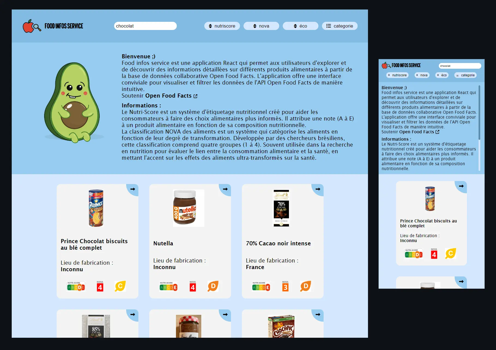

# Titre de l'Application : FOOD INFOS SERVICE

## Description :

Food infos service est une application React qui permet aux utilisateurs d'explorer et de découvrir des informations détaillées sur différents produits alimentaires à partir de la base de données collaborative Open Food Facts. L'application offre une interface conviviale pour visualiser et filtrer les données de l'API Open Food Facts de manière intuitive.

## Fonctionnalités clés :

### Recherche de Produits :

Les utilisateurs peuvent rechercher des produits alimentaires en utilisant des mots-clés, des catégories ou d'autres critères pertinents. L'application effectue des requêtes à l'API Open Food Facts pour récupérer des données actualisées.

### Affichage de Détails :

Chaque produit affiche des détails tels que son nom, sa catégorie, son pays d'origine, ses ingrédients, et d'autres informations importantes. Les images des produits sont également présentées pour une visualisation rapide.

### Filtrage et Tri :

Les utilisateurs ont la possibilité de filtrer les résultats en fonction de différentes catégories, du pays d'origine, ou d'autres critères spécifiques. De plus, un mécanisme de tri peut être utilisé pour organiser les résultats en fonction de diverses caractéristiques.

### Interaction Intuitive :

L'application offre une expérience utilisateur fluide avec une navigation simple entre les produits. Les utilisateurs peuvent cliquer sur un produit pour obtenir plus de détails.

### Gestion chargement :

Des indicateurs visuels tels que des loaders sont utilisés pour informer les utilisateurs du chargement en cours lors de la récupération des données depuis l'API.

### Design Responsif :

L'interface de l'application est conçue de manière à être réactive, offrant une expérience utilisateur cohérente sur les différents appareils, des ordinateurs de bureau aux smartphones.

## Technologies Utilisées :

React (Hooks, State)
Axios pour les requêtes HTTP
SASS pour le style
